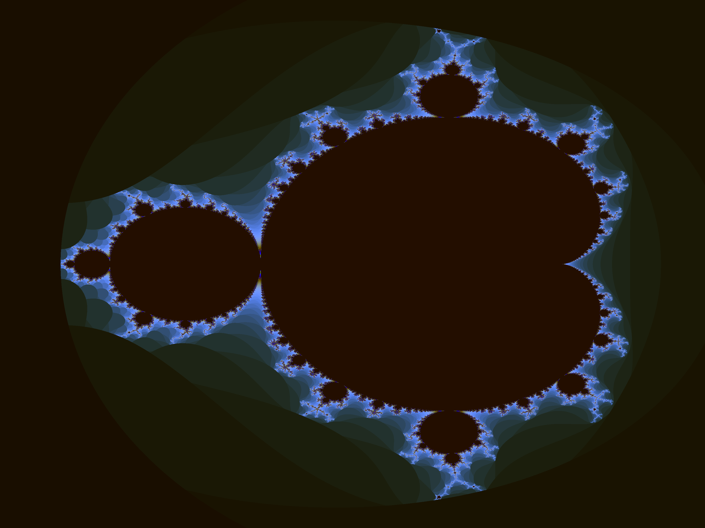

# Mandelbrot Fractal in C++ using Vulkan Compute

This is a demo application that uses the Vulkan C++ API to draw a Mandelbrot fractal.

This application is an adaptation of [Erkaman/vulkan_minimal_compute](https://github.com/Erkaman/vulkan_minimal_compute/)
to use the [Vulkan-Hpp](https://github.com/KhronosGroup/Vulkan-Hpp) C++ library from Khronos.



# Dependencies

You need a C++14 compiler.

All the library dependencies are included.

  * [lodepng](https://github.com/lvandeve/lodepng)
  * [Vulkan Extension Loader](https://github.com/KhronosGroup/Vulkan-Docs/blob/1.0/src/ext_loader/)

# Building

```shell
mkdir build
cd build
cmake ..
make
```

# Execution

From the `mandelbrot_vulkan_cpp` directory, run:

```shell
build/mandelbrot
```

The application launches a compute shader that renders the Mandelbrot set into a storage buffer on the GPU.
The storage buffer is then read and saved as `mandelbrot.png`.
